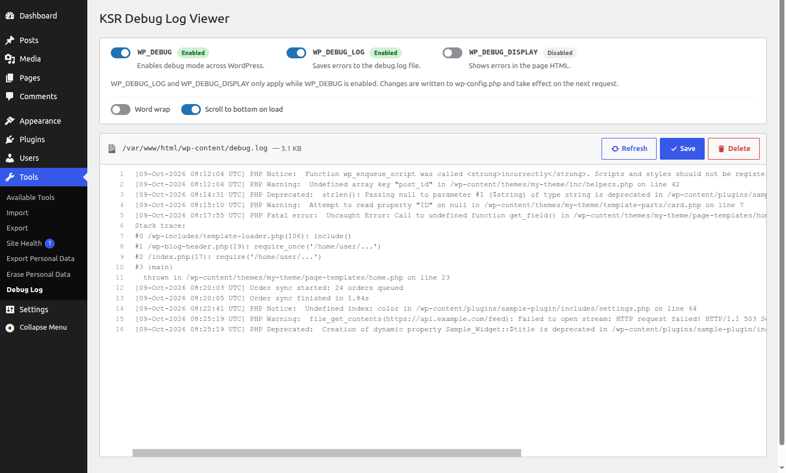

# KSR Debug Log Viewer

A WordPress plugin to view and manage your `debug.log` right from the admin, no FTP needed.

## Features

- Shows your `debug.log` in a full-screen, code-editor-style view with line numbers
- Lets you edit and save the log, or delete it with one click
- Lets you turn `WP_DEBUG`, `WP_DEBUG_LOG` and `WP_DEBUG_DISPLAY` on or off with simple switches
- Works without page reloads
- Minimal and lightweight: nothing is saved to the database
- Uses only jQuery, no JS frameworks

## How to use

1. Install and activate the plugin.
2. Go to **Tools → Debug Log**.
