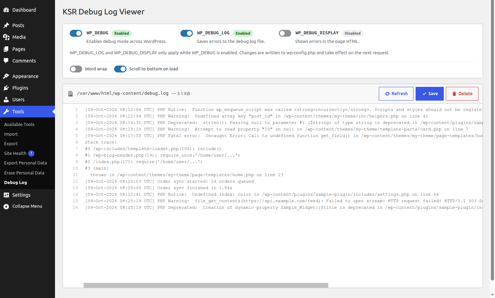

# KSR Debug Log Viewer

A WordPress plugin to view and manage your `debug.log` right from the admin, no FTP needed.

## Features

- Shows your `debug.log` in a full-screen, code-editor-style view
- Lets you edit and save the log, or delete it with one click
- Lets you turn `WP_DEBUG`, `WP_DEBUG_LOG` and `WP_DEBUG_DISPLAY` on or off with simple switches
- Minimal and lightweight: nothing is saved to the database
- Uses only jQuery, no JS frameworks

## How to use

1. Install and activate the plugin.
2. Go to **Tools → Debug Log**.

## Multisite support

All sites in a network share one `debug.log` and one `wp-config.php`, so the plugin treats them as network-wide:

- **Network-activated:** the page appears only in **Network Admin → Settings → Debug Log**, not in each site's admin.
- **Activated on a single site:** the page appears under **Tools → Debug Log** on that site.
- In both cases, only super admins can open the page.
